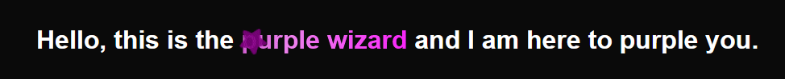
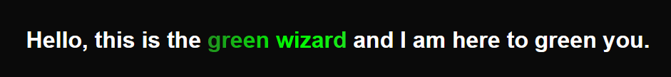

# Magical-Text-Effect
This is an *almost* carbon-copy of the [Magical Text](https://www.youtube.com/watch?v=yu0Cm4BqQv0) by [Hyperplexed](https://www.youtube.com/@Hyperplexed) specifically made to by used in React.  
The star and square icons are from the [Font Awesome](https://fontawesome.com/)'s free pack.

## Dependencies
Excluding React, none.

## Running the example
Clone the project, enter the project's folder, do `npm install`, then `npm start` and it's up.

## Usage
To use this component, `MagicText.js`, `MagicText.css` and by default, the `star.svg` icon are required from the `src` folder.

Only the `text` property is explicity needed:
```html
<h1>
    Hello, this is the <MagicText text={"purple wizard"}/> and I am here to purple you.
</h1>
```
with by default, a purple gradient-moving background with purple pulsating and rotating stars:



Component properties:
- text: The text to display
- particleCount: How many particles
- particleSvg: The particle SVG
- particleStyling: Custom styling for a particle
- textStyling: Custom styling for the text

Example of a customized `MagicText` component:
```js
const styling = {
  text: {
      background: "linear-gradient(to right, DarkGreen, ForestGreen, Lime, LimeGreen)",
      backgroundSize: "200%",
  },
  particle: {
      scale: "1",
      fill: "#23a60866"
  }
}
```
```html
<h1>
    Hello, this is the <MagicText text={"green wizard"}
        particleCount={2}
        oneParticleDelay={700}
        particleSvg={<Square/>}
        particleStyling={styling.particle}
        textStyling={styling.text}
    /> and I am here to green you.
</h1>
```

(this example is also in the source code)
